# Project 3

**Backend Configuration**
___

updating ubuntu

` $ sudo apt update`

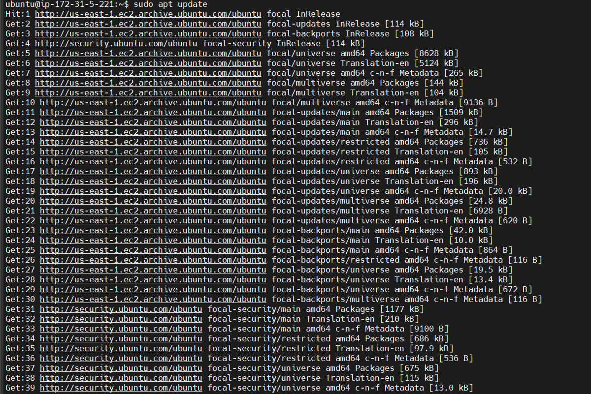

upgrading ubuntu

` $ sudo apt upgrade`

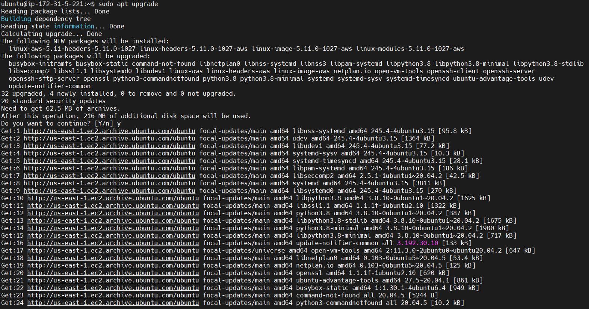

getting nodejs location from ubuntu repositories

` $ curl -sL https://deb.nodesource.com/setup_12.x | sudo -E bash -`

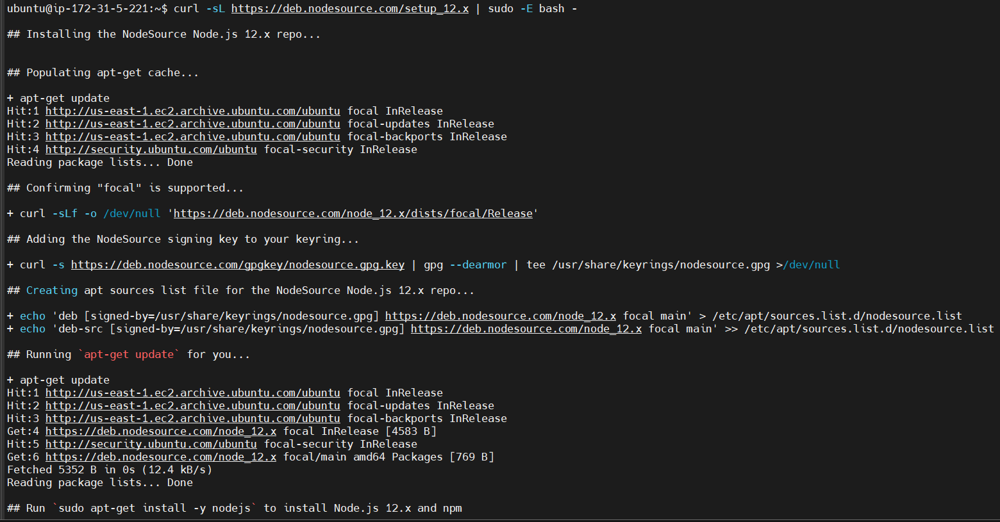

installing nodejs & npm on the server

` $ sudo apt-get install -y nodejs`

verifying node installation

` $ node -v`

verifying npm installation

` $ npm -v`

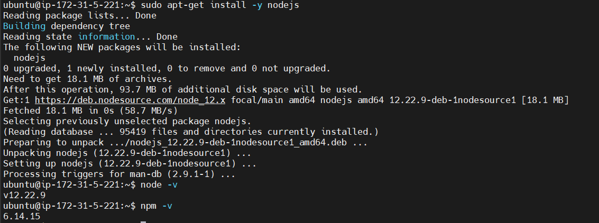

**application code setup**

creating a new directory for the todo project

` $ mkdir Todo`

verifying todo directory

` $ ls`

changing directory to newly created one

` $ cd Todo`

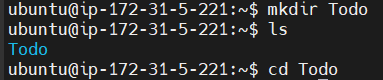

initializing project so package.json will be created

` $ npm init`

confirmation

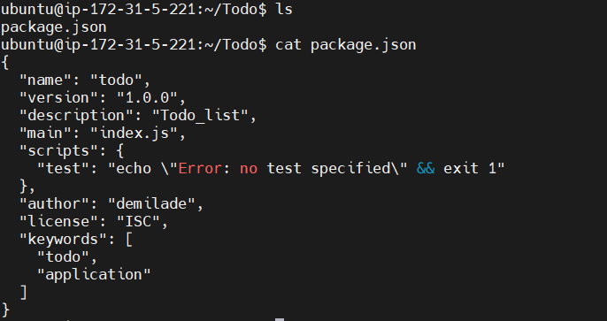

installing expressjs

` $ npm install express`

creating index.js file

` $ touch index.js`

installing dotenv module

` $ npm install dotenv`

opening index.js file 

` $ vim index.js`

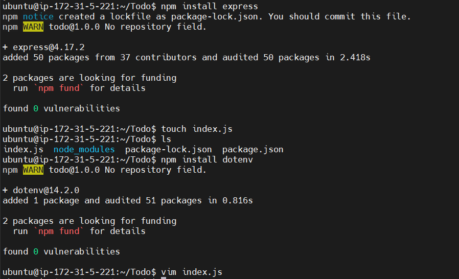

inside index.js

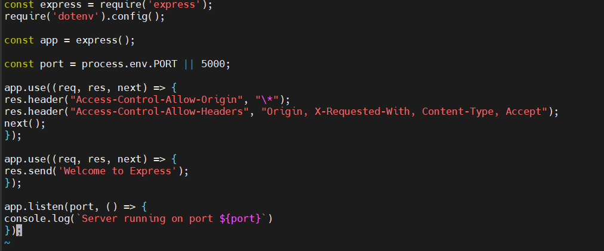

testing to see if server works - it should work on port 5000

` $ node index.js`

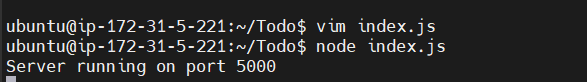

opening TCP port 5000 in EC2 security group

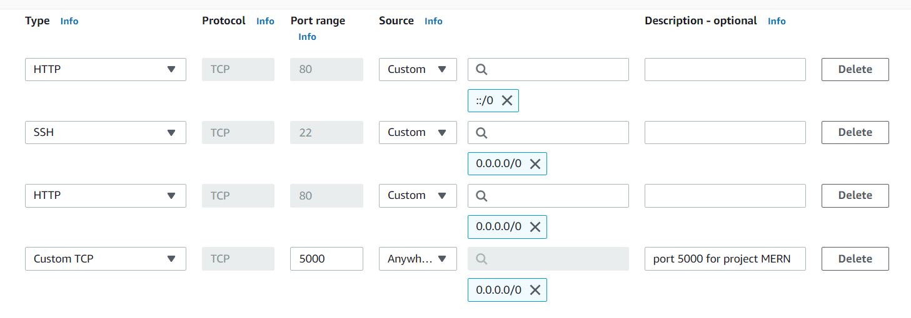

running public ip + port 5000

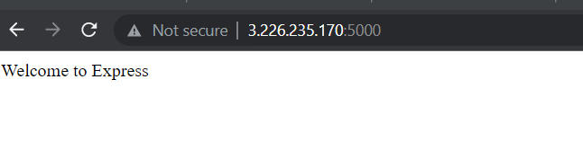

**routes**

creating routes directory

` $ mkdir routes`

` $ cd routes`

create api.js file

` $ touch api.js`

open api.js file

` $ vi api.js`

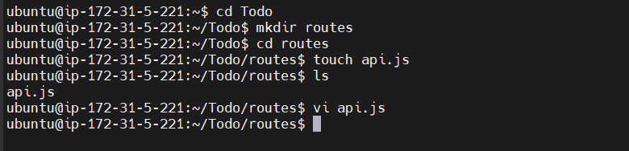

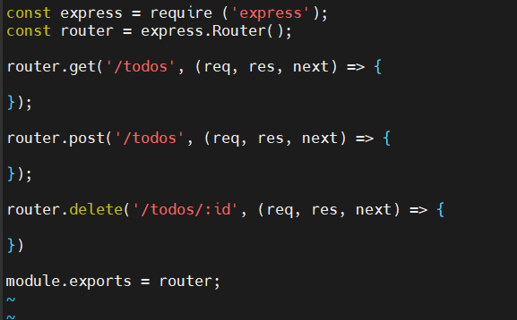

**models**

*installing mongoose - a nodejs package - that makes working with mongodb easier*

change directory back to todo folder 

` $ npm install mongoose`

create directory - models, cd into models and create todo.js file

` $ mkdir models && cd models && touch todo.js`

open todo.js

` $ vim todo.js`

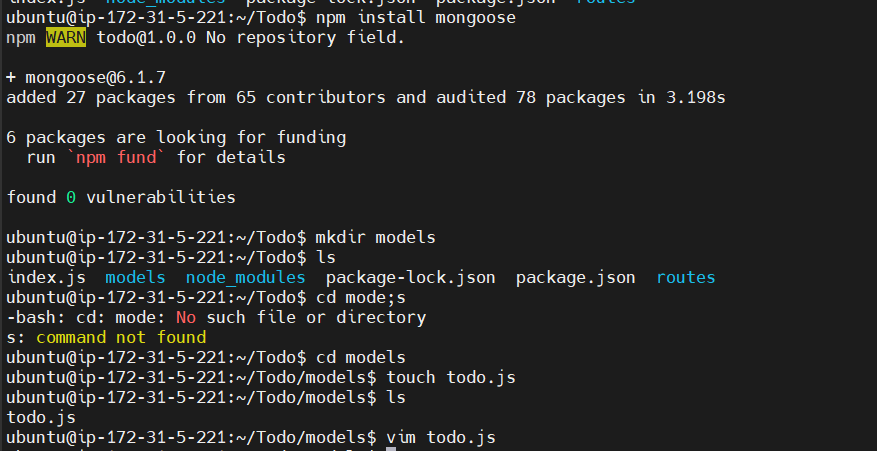

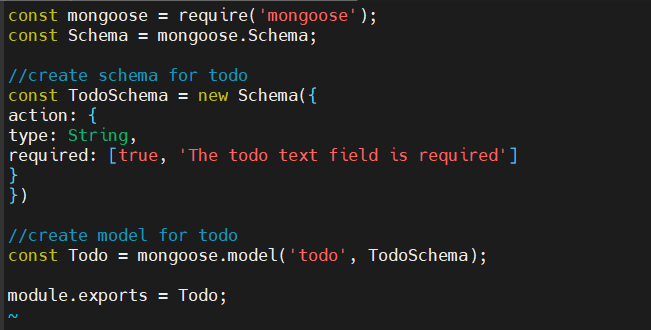

updating the code in the api.js file - within routes directory

`$ cd routes`

` $ vim api.js`

