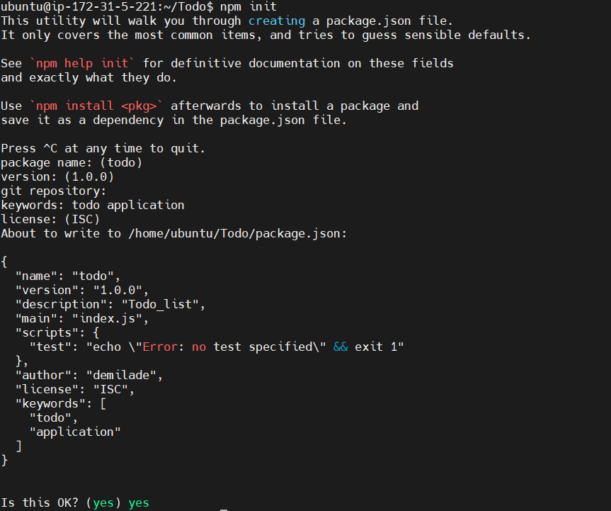
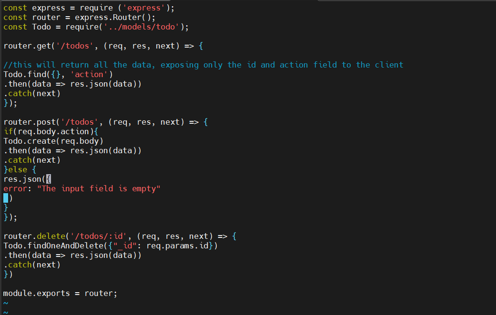
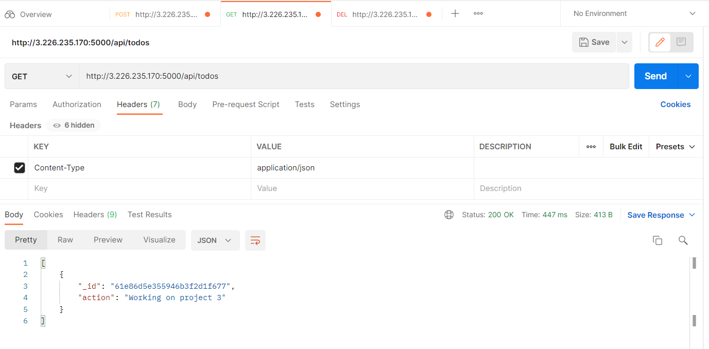

# Project 3

**Backend Configuration**
___

updating ubuntu

` $ sudo apt update`

upgrading ubuntu

` $ sudo apt upgrade`

getting nodejs location from ubuntu repositories

` $ curl -sL https://deb.nodesource.com/setup_12.x | sudo -E bash -`

installing nodejs & npm on the server

` $ sudo apt-get install -y nodejs`

verifying node installation

` $ node -v`

verifying npm installation

` $ npm -v`

**application code setup**

creating a new directory for the todo project

` $ mkdir Todo`

verifying todo directory

` $ ls`

changing directory to newly created one

` $ cd Todo`

initializing project so package.json will be created

` $ npm init`

confirmation

installing expressjs

` $ npm install express`

creating index.js file

` $ touch index.js`

installing dotenv module

` $ npm install dotenv`

opening index.js file 

` $ vim index.js`

inside index.js

testing to see if server works - it should work on port 5000

` $ node index.js`

opening TCP port 5000 in EC2 security group

running public ip + port 5000

**routes**

creating routes directory

` $ mkdir routes`

` $ cd routes`

create api.js file

` $ touch api.js`

open api.js file

` $ vi api.js`

**models**

*installing mongoose - a nodejs package - that makes working with mongodb easier*

change directory back to todo folder 

` $ npm install mongoose`

create directory - models, cd into models and create todo.js file

` $ mkdir models && cd models && touch todo.js`

open todo.js

` $ vim todo.js`

updating the code in the api.js file - within routes directory

`$ cd routes`

` $ vim api.js`

**mongodb database**

creating cluster

setting up network access

creating mongodb database and collection inside mlab

going back to todo directory to create .env file to access environment variables

` $ touch .env`

` $ vi .env`

add this connection string to access the database

` $ DB = 'mongodb+srv://<username>:<password>@<network-address>/<dbname>?retryWrites=true&w=majority'`

updating index.js to reflect the use of .env so nodejs can connect to the database

` $ vim index.js`

delete the previous code

paste this:

` $ const express = require('express');
const bodyParser = require('body-parser');
const mongoose = require('mongoose');
const routes = require('./routes/api');
const path = require('path');
require('dotenv').config();

const app = express();

const port = process.env.PORT || 5000;

//connect to the database
mongoose.connect(process.env.DB, { useNewUrlParser: true, useUnifiedTopology: true })
.then(() => console.log(`Database connected successfully`))
.catch(err => console.log(err));

//since mongoose promise is depreciated, we overide it with node's promise
mongoose.Promise = global.Promise;

app.use((req, res, next) => {
res.header("Access-Control-Allow-Origin", "\*");
res.header("Access-Control-Allow-Headers", "Origin, X-Requested-With, Content-Type, Accept");
next();
});

app.use(bodyParser.json());

app.use('/api', routes);

app.use((err, req, res, next) => {
console.log(err);
next();
});

app.listen(port, () => {
console.log(`Server running on port ${port}`)
});`

start server using:

` $ node index.js`

##### Database connected successfully means the backend is configured

**testing backend code without frontend using RESTful API**

i used postman to test my api

**POST request**

Header: Content-Type

Value: Applicatiion/json

**GET request**

Header: Content-Type

Value: Application/json

**DELETE request**

Header: Content-Type

Value: Application/json

**POST request again**

Header: Content-Type

Value: Application/json

**frontend creation**

using *create-react-app* command to scaffold app

` $ npx create-react-app client`

**running a react app**

installing concurrently

` $ npm install concurrently --save-dev`

installing nodemon

` $ npm install nodemon --save-dev`

open package.json file and change a part of the code

**configuring proxy in package.json**

changing directory to client

` $ cd client`

opening package.json file

` $ vi package.json`

add the key value pair to the file: "proxy": "http://localhost:5000"

go back todo directory and run:

` $ npm run dev`

the app should run on localhost:3000

to access the application via the internet i opened tcp port 3000 on ec2 

**creating react components**

 move to src directory

` $ cd src`

create components directory

` $ mkdir components`

` $ cd components`

create Input.js, ListTodo.js and Todo.js in components

` $ touch Input.js ListTodo.js Todo.js`

` $ vi Input.js`

move back to client directory

` cd ..`

install axios

` $ npm install axios`

